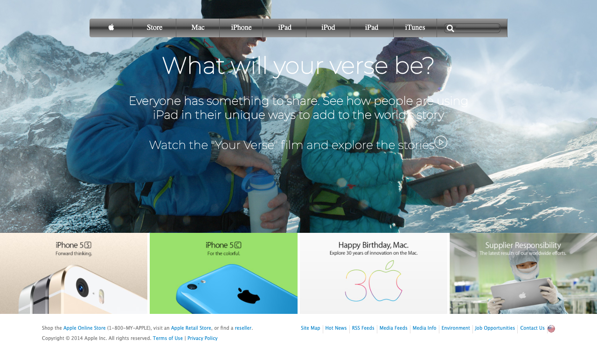

# Project: Building with Backgrounds and Gradients
This is a cloned version of Apple's old (2014) website. The aim of the project is to better understand how to use images as backgrounds and add gradients to elements.

Apple's old website clone using the concept of
<ul>
<li>Grid and flex</li>
<li>Gradients</li>
<li>Absolute and relative positioning</li>
</ul>

# Built with
<ul>
<li>HTML</li>
<li>CSS</li>
<li>Font Awesome</li>
<li>Google fonts</li>
</ul>

# Live Demo
<a href="https://raw.githack.com/ahmadchata/apple/feature-homepage.html">Live Demo Link</a>

# Authors
<ul>
<li>GitHub: @ahmadchata</li>
<li>Twitter: @ahmadchata</li>
<li>LinkedIn: https://www.linkedin.com/in/ahmad-chata-957b9b51/</li>
</ul>

# Show your support
Give a :star: if you like this project

# Acknowlegdements
<ul>
<li>Hat tip to Odin Project</li>
<li>Apple website</li>
<li>Microverse</li>
</ul>